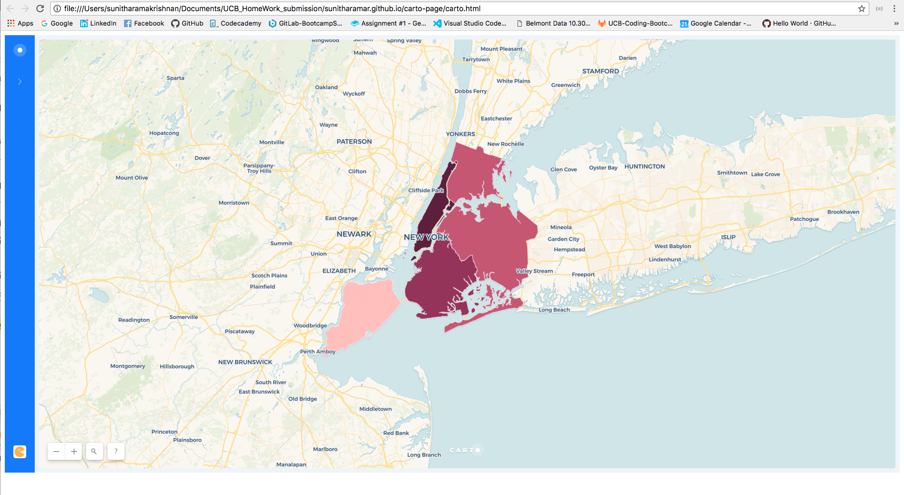

# This is my Carto page and it is embedded in a iframe.

How to run:

1) On a terminal
python -m http.server
Sunithas-MacBook-Pro:Reputation sunitharamakrishnan$ python -m http.server
Serving HTTP on 0.0.0.0 port 8000 (http://0.0.0.0:8000/) ...
127.0.0.1 - - [23/Mar/2018 14:54:47] "GET / HTTP/1.1" 200 -
127.0.0.1 - - [23/Mar/2018 14:54:59] "GET / HTTP/1.1" 200 -

2) launch on a webpage:
http://0.0.0.0:8000/
to see the carto map...its cool.

3) another option, can also launch directly by clicking on a "carto.html" to see the carto page launched onto the web.

4) I have converted this ipython README page with the following:
                 
         ipython nbconvert --to markdown README.ipynb
    
    which in turn with give a output of README.md <-- this has the correct format to launch on github.


```python
from IPython.display import Image
Image(filename='./carto.png')
```





